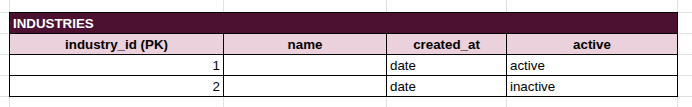
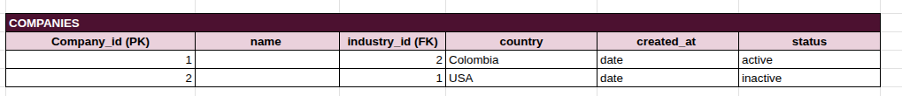
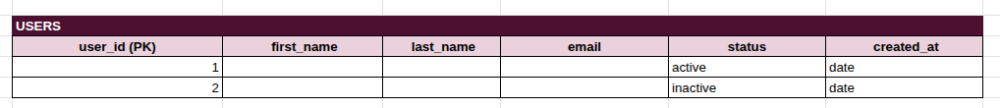
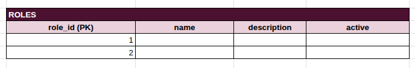
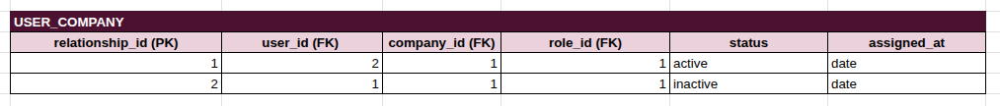
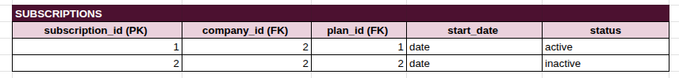
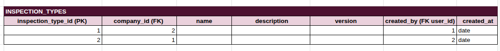
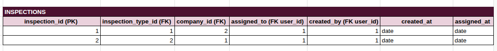
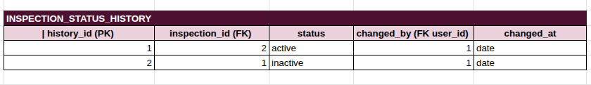

El modelo relacional fue diseñado bajo los principios de la Tercera Forma Normal (3NF) para garantizar integridad, consistencia y evitar redundancia de datos. Se separaron entidades como industrias, roles, planes de servicio y tipos de inspección para eliminar dependencias transitivas y asegurar que cada atributo dependa únicamente de su clave primaria. Además, se implementó una tabla intermedia para resolver la relación muchos a muchos entre usuarios y empresas. La información estructurada y crítica del sistema se almacena en SQL, mientras que los datos dinámicos de las inspecciones se gestionan en NoSQL, permitiendo mayor flexibilidad y escalabilidad.